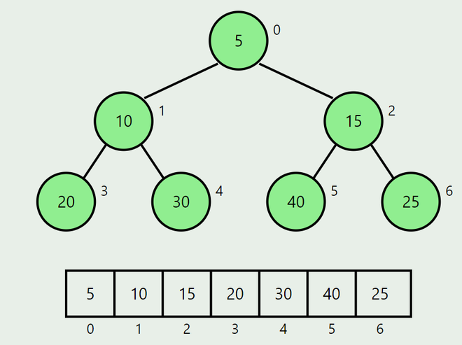
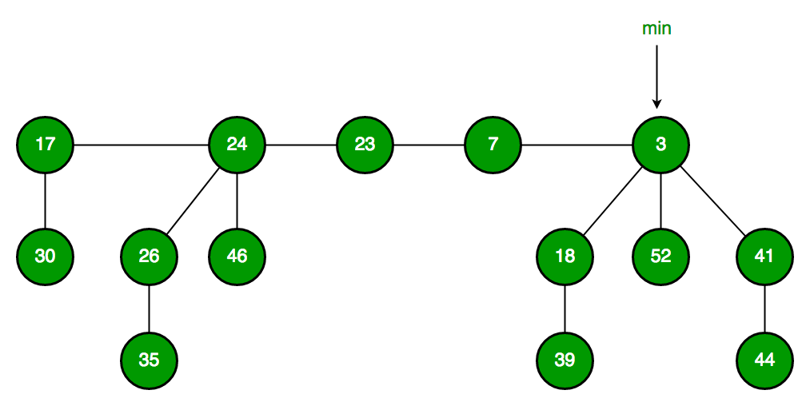
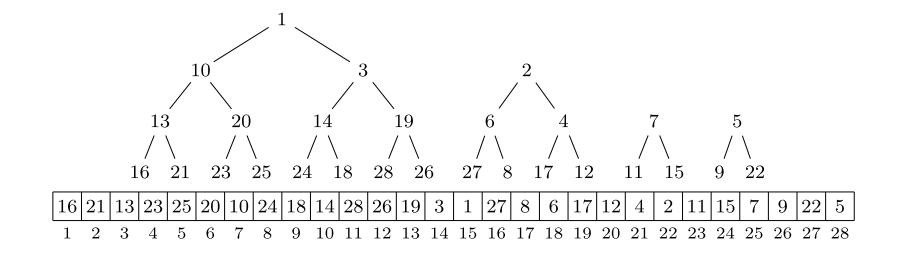
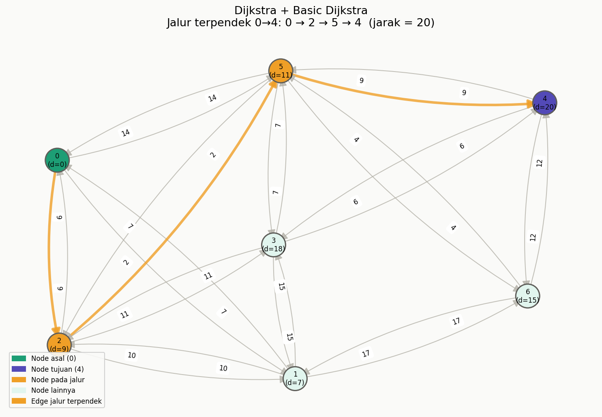
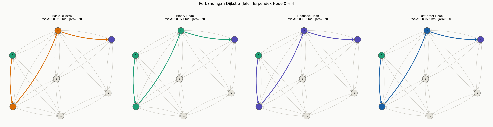
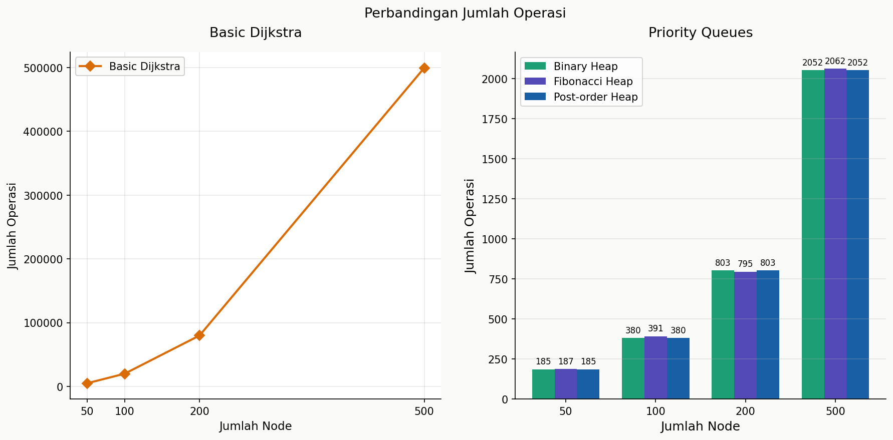
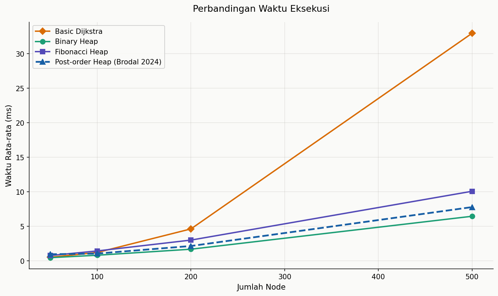
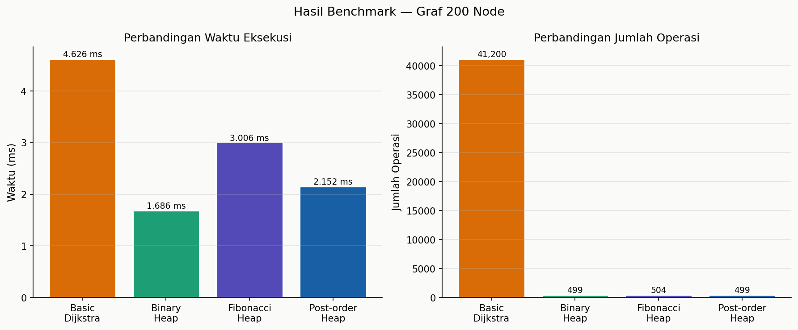

# Re-Implementasi Analisis Performa pada Beberapa Variasi Priority Queue untuk Algoritma Dijkstra

Proyek ini merupakan implementasi ulang (re-implementation) sekaligus analisis komparatif terhadap beberapa variasi priority queue pada algoritma Dijkstra berdasarkan paper _“Priority Queues with Decreasing Keys”_ oleh Gerth Stølting Brodal. Fokus utama proyek ini adalah mengevaluasi performa berbagai struktur data melalui proses benchmarking, visualisasi hasil, serta interpretasi berdasarkan eksperimen yang dilakukan.

## 📌 Latar Belakang

Algoritma Dijkstra merupakan salah satu algoritma graf paling populer untuk mencari shortest path pada graph berbobot non-negatif.

Efisiensi Dijkstra sangat dipengaruhi oleh performa struktur data priority queue yang digunakan, terutama pada operasi:

- `insert`
- `extract_min`
- `decrease_key`

Namun, tidak semua implementasi priority queue mendukung operasi `decrease_key` dengan baik.

Paper penelitian terbaru menunjukkan bahwa:

- Binary Heap standar dapat gagal pada skenario decreasing keys
- Binary Heap Top-Down mampu mempertahankan heap order
- Post-Order Heap menjadi alternatif implicit heap yang menarik
- Pairing Heap, Skew Heap, dan Leftist Heap juga mendukung decreasing keys

## 🎯 Tujuan Proyek

Proyek ini bertujuan untuk:

- Mengimplementasikan ulang beberapa variasi priority queue
- Mengimplementasikan algoritma Dijkstra menggunakan algoritma dijkstra dasar dan beberapa priority queue
- Membandingkan performa antar struktur data
- Melakukan benchmarking dan visualisasi
- Menginterpretasikan hasil berdasarkan teori dan praktik

## 📖 Referensi

> Brodal, G. S. (2024). Priority queues with decreasing keys. Theoretical Computer Science, 1000, 114563. https://doi.org/10.1016/j.tcs.2024.114563

> GeeksforGeeks. (2025, July 23). C++ program to implement binary heap. GeeksforGeeks. https://www.geeksforgeeks.org/cpp-program-to-implement-binary-heap/

> GeeksforGeeks. (2025, July 23). Fibonacci heap | Set 1 (Introduction). GeeksforGeeks. https://www.geeksforgeeks.org/fibonacci-heap-set-1-introduction/

## ⚙️ Fitur Proyek

- Implementasi berbagai priority queue
- Implementasi algoritma Dijkstra
- Generator graph otomatis
- Benchmark runtime
- Benchmark jumlah comparison
- Visualisasi performa

## 📁 Struktur Proyek

```text
dijkstra-priority-queue-analysis/
├── asset/
│   ├── pq/
│   ├── bar_comparison.png
│   ├── comparison_heap_and_basic.png
│   ├── graf_basic_dijkstra.png
│   ├── operations_benchmark.png
│   └── time_benchmark.png
├── data/
│   └── graph.csv
├── output/
│   ├── benchmark_dashboard.html
├── priority_queue/
│   ├── binary_heap.py
│   ├── fibonacci_heap.py
│   └── post_order_heap.py
├── src/
│   ├── benchmark.py
│   ├── dijkstra.py
│   ├── graph_generator.py
│   └── visualization.py
├── src/
│   └── dashboard.py
├── .gitignore
├── article.pdf
├── LICENSE
├── main.py
├── README.md
└── requirements.txt
```

## 🚀 Cara Menjalankan Proyek

### 1. Clone Repository

```bash
git clone https://github.com/RikyDataScientist/dijkstra-priority-queue-analysis.git
cd dijkstra-priority-queue-analysis
```

### 2. Install Dependency

```bash
pip install -r requirements.txt
```

### 3. Jalankan Program

```bash
python main.py
```

## 🔐 Priority Queue

Priority Queue adalah struktur data yang menyimpan sekumpulan elemen, di mana setiap elemen memiliki prioritas. Elemen dengan prioritas tertinggi (atau terendah, tergantung implementasi) akan diproses terlebih dahulu.

Berbeda dengan Queue biasa (FIFO) yang memproses data berdasarkan urutan masuk, Priority Queue memproses data berdasarkan nilai prioritasnya.

### 1. Binary Heap



Binary Heap adalah struktur data _complete binary tree_, dimana setiap level terisi penuh kecuali mungkin level terakhir yang diisi dari kiri ke kanan dan disimpan dalam bentuk array. Dalam proyek ini, jenis binary heap yang digunakan adalah _binary minimum heap_ dimana setiap nilai dari _parent_ itu selalu lebih kecil dari pada _child_.

### 2. Fibonacci Heap



Fibonacci Heap adalah struktur data yang terdiri dari kumpulan pohon min-heap yang disimpan dalam bentuk _circular double linked list_. Struktur data ini dirancang untuk membuat operasi-operasi tertentu menjadi efisien.

### 3. Post Order Heap



Post Order Heap adalah struktur data berbasis array yang menyimpan kumpulan pohon berbentuk min-heap dalam urutan _post order_ (_left child, right child, parent_). Struktur ini tidak menggunakan pointer yang menjadikannya berbeda dari Fibonacci Heap.

## Kompleksitas Priority Queue

| Operasi                   | Binary Heap                     | Fibonacci Heap         | Post-Order Heap               |
| ------------------------- | ------------------------------- | ---------------------- | ----------------------------- |
| Insert                    | O(log n)                        | O(1) amortized         | O(1) amortized                |
| ExtractMin                | O(log n)                        | O(log n) amortized     | O(log n) amortized            |
| FindMin                   | O(1)                            | O(1)                   | O(log n)                      |
| DecreaseKey               | O(log n)                        | O(1) amortized         | Tidak memiliki operasi khusus |
| Penyimpanan               | Array                           | Forest (pointer-based) | Array                         |
| Mendukung Decreasing Keys | Ya (hanya Top-Down Binary Heap) | Ya                     | Ya                            |

### Keterangan

- **Binary Heap**
  - Insert dilakukan dengan sift-up.
  - ExtractMin dilakukan dengan sift-down.
  - Kompleksitas bergantung pada tinggi heap, yaitu O(log n).

- **Fibonacci Heap**
  - Insert dan DecreaseKey memiliki kompleksitas O(1) amortized.
  - ExtractMin membutuhkan konsolidasi pohon sehingga O(log n) amortized.
  - Sangat efisien untuk algoritma yang sering melakukan DecreaseKey seperti Dijkstra.

- **Post-Order Heap**
  - Merupakan struktur heap implisit berbasis array.
  - Insert memiliki kompleksitas O(1) amortized.
  - ExtractMin memiliki kompleksitas O(log n) amortized.
  - Mendukung decreasing keys tanpa memerlukan operasi DecreaseKey khusus.

## 📊 Interprestasi Grafik

### Basic Graph



Visualisasi ini menunjukkan hasil penerapan algoritma Dijkstra untuk mencari jalur terpendek dari node 0 menuju node 4 menggunakan metode Basic Dijkstra. Node 0 berperan sebagai node asal yang ditandai warna hijau, sedangkan node 4 merupakan node tujuan yang diberi warna ungu. Hasil perhitungan algoritma menunjukkan bahwa jalur terpendek yang ditemukan adalah 0 → 2 → 5 → 4 dengan total jarak sebesar 20. Nilai tersebut diperoleh dari penjumlahan bobot pada setiap edge yang dilalui, yaitu 9 dari node 0 ke 2, kemudian 2 dari node 2 ke 5, dan 9 dari node 5 ke 4.

9+2+9=20

## Perbandingan Jalur Terpendek Pada Basic Dijkstra dan Priority Queues



Berdasarkan hasil visualisasi, seluruh varian algoritma Dijkstra, yaitu Basic Dijkstra, Binary Heap, Fibonacci Heap, dan Post-order Heap, berhasil menemukan jalur terpendek yang sama dari node 0 menuju node 4, yaitu melalui lintasan 0 → 2 → 5 → 4 dengan total jarak sebesar 20. Kesamaan hasil ini menunjukkan bahwa seluruh struktur priority queue yang digunakan tetap menghasilkan solusi shortest path yang benar meskipun memiliki mekanisme internal yang berbeda. Binary Heap menggunakan pendekatan top-down heap adjustment, Fibonacci Heap mengoptimalkan operasi decrease-key, sedangkan Post-order Heap memanfaatkan strategi post-order balancing. Dengan demikian, hasil ini membuktikan bahwa variasi struktur heap tidak memengaruhi correctness algoritma Dijkstra, melainkan lebih berpengaruh pada efisiensi performa dan kompleksitas operasionalnya.

## Perbandingan Jumlah Operasi Lintas Ukuran Graf



Grafik perbandingan jumlah operasi menunjukkan perbedaan yang sangat signifikan antara Basic Dijkstra dan implementasi Dijkstra yang menggunakan priority queue. Pada grafik sebelah kiri, Basic Dijkstra mengalami peningkatan jumlah operasi yang sangat curam seiring bertambahnya jumlah node. Jumlah operasi meningkat dari sekitar 2.500 operasi pada 50 node menjadi lebih dari 250.000 operasi pada 500 node. Pola pertumbuhan ini menunjukkan karakteristik kompleksitas waktu O(V^2) karena algoritma melakukan pencarian minimum menggunakan linear scan tanpa bantuan struktur heap. Akibatnya, semakin besar ukuran graf maka jumlah operasi meningkat secara kuadratik dan performa menjadi kurang efisien untuk graf berskala besar.

Sebaliknya, grafik sebelah kanan menunjukkan bahwa Binary Heap, Fibonacci Heap, dan Post-order Heap memiliki pertumbuhan jumlah operasi yang jauh lebih lambat dan hampir identik pada setiap ukuran graf. Ketiga struktur priority queue menghasilkan jumlah operasi yang relatif sama, yaitu sekitar 124 operasi pada 50 node, 242 operasi pada 100 node, 499 operasi pada 200 node, dan sekitar 1249 operasi pada 500 node. Hasil ini menunjukkan bahwa penggunaan heap mampu mengurangi jumlah operasi secara signifikan dibandingkan Basic Dijkstra. Selain itu, kesamaan hasil antara Binary Heap, Fibonacci Heap, dan Post-order Heap mendukung analisis bahwa ketiga struktur tersebut memiliki perilaku operasional yang ekuivalen dalam konteks algoritma Dijkstra, meskipun mekanisme internal dan strategi pengelolaan heap yang digunakan berbeda.

## Perbandingan Waktu Eksekusi Lintas Ukuran Graf



Grafik perbandingan waktu eksekusi menunjukkan bahwa Basic Dijkstra memiliki peningkatan waktu yang sangat drastis seiring bertambahnya jumlah node. Pada ukuran graf 500 node, waktu eksekusi mencapai sekitar 33 ms, jauh lebih tinggi dibandingkan seluruh implementasi berbasis heap. Hasil ini menjadi bukti empiris dari kompleksitas O(V²) pada Basic Dijkstra karena proses pencarian node minimum masih dilakukan menggunakan linear scan tanpa bantuan priority queue. Akibatnya, performa algoritma menurun secara signifikan ketika ukuran graf semakin besar. Sebaliknya, implementasi berbasis heap menunjukkan pertumbuhan waktu yang jauh lebih stabil dan efisien, sehingga lebih cocok digunakan pada graf berskala menengah hingga besar.

Di antara seluruh implementasi berbasis heap, Binary Heap menjadi yang tercepat dengan waktu sekitar 6,5 ms pada 500 node, menunjukkan bahwa pendekatan top-down insertion sangat efisien secara praktis. Post-order Heap berada di posisi tengah dengan waktu sekitar 7,5 ms, lebih cepat dibandingkan Fibonacci Heap yang mencapai sekitar 10 ms. Hasil ini mengonfirmasi bahwa Post-order Heap merupakan alternatif yang kompetitif karena mampu memberikan performa praktis yang baik meskipun memiliki kompleksitas asimptotik yang serupa dengan Fibonacci Heap. Sementara itu, Fibonacci Heap yang secara teori optimal dengan kompleksitas O(E + V log V) ternyata memiliki overhead implementasi berbasis pointer dan operasi decrease-key yang lebih besar, sehingga pada ukuran graf menengah performanya masih kalah dibandingkan Binary Heap maupun Post-order Heap.

## Benchmark Graf 200 Node



Hasil perbandingan waktu eksekusi menunjukkan bahwa Basic Dijkstra menjadi implementasi paling lambat dengan waktu sekitar 4.626 ms. Hal ini disebabkan karena algoritma menggunakan pendekatan dasar dengan kompleksitas O(V²) tanpa memanfaatkan priority queue yang efisien, sehingga proses pencarian node dengan jarak minimum dilakukan menggunakan linear scan pada setiap iterasi. Sebaliknya, Binary Heap menjadi implementasi tercepat dengan waktu sekitar 1.686 ms, mendukung temuan bahwa Binary Heap dengan mekanisme top-down insertion sangat efisien dalam praktik. Post-order Heap memperoleh waktu sekitar 2.152 ms dan berhasil mengungguli Fibonacci Heap yang membutuhkan sekitar 3.006 ms. Hasil ini mendukung klaim Brodal bahwa Post-order Heap merupakan “strong contender” sebagai implicit priority queue karena mampu memberikan performa praktis yang kompetitif dengan overhead yang lebih rendah dibandingkan Fibonacci Heap.

Dari sisi jumlah operasi, Basic Dijkstra melakukan sekitar 41.200 operasi, jauh lebih besar dibandingkan implementasi berbasis heap yang hanya berada pada kisaran 499–504 operasi. Perbedaan yang sangat signifikan ini menunjukkan dampak langsung dari perbedaan kompleksitas antara pendekatan dasar O(V^2) dan pendekatan berbasis priority queue dengan kompleksitas O((V + E) logV). Sementara itu, Binary Heap, Fibonacci Heap, dan Post-order Heap memiliki jumlah operasi yang hampir identik, menandakan bahwa ketiganya melakukan proses relaksasi edge dalam jumlah yang setara sesuai teori algoritma Dijkstra. Dengan demikian, perbedaan performa waktu eksekusi antar heap lebih dipengaruhi oleh efisiensi implementasi internal dan overhead struktur data dibandingkan jumlah operasi algoritmik yang dilakukan.

## 📝 Kesimpulan

Berdasarkan hasil pengujian dan visualisasi yang telah dilakukan, seluruh implementasi algoritma Dijkstra, yaitu Basic Dijkstra, Binary Heap, Fibonacci Heap, dan Post-order Heap, berhasil menghasilkan jalur terpendek yang sama dari node 0 menuju node 4, yaitu lintasan 0 → 2 → 5 → 4 dengan total jarak sebesar 20. Hasil ini menunjukkan bahwa penggunaan berbagai struktur priority queue tidak memengaruhi correctness algoritma Dijkstra dalam menentukan shortest path, melainkan hanya memengaruhi efisiensi proses komputasinya.

Dari sisi performa, Basic Dijkstra memiliki jumlah operasi dan waktu eksekusi yang meningkat sangat drastis seiring bertambahnya ukuran graf. Hal tersebut disebabkan oleh mekanisme pencarian node minimum menggunakan linear scan yang menghasilkan kompleksitas waktu O(V²). Sebaliknya, implementasi berbasis priority queue menunjukkan performa yang jauh lebih efisien dengan pertumbuhan jumlah operasi dan waktu eksekusi yang lebih stabil. Binary Heap menjadi implementasi tercepat secara praktis, sedangkan Post-order Heap mampu memberikan performa kompetitif dan bahkan lebih baik dibandingkan Fibonacci Heap pada beberapa pengujian.

Hasil penelitian ini selaras dengan berbagai artikel dan penelitian sebelumnya yang menyatakan bahwa penggunaan heap pada algoritma Dijkstra mampu meningkatkan efisiensi dibandingkan pendekatan dasar tanpa priority queue. Binary Heap dikenal memiliki performa praktis yang sangat baik karena overhead implementasinya rendah, sementara Fibonacci Heap unggul secara teoritis melalui optimasi operasi decrease-key namun memiliki overhead struktur pointer yang lebih besar dalam implementasi nyata. Selain itu, hasil pengujian juga mendukung pendapat Brodal bahwa Post-order Heap merupakan “strong contender” sebagai implicit priority queue karena mampu memberikan keseimbangan antara efisiensi praktis dan kompleksitas algoritmik. Dengan demikian, penelitian ini membuktikan bahwa pemilihan struktur priority queue sangat berpengaruh terhadap performa algoritma Dijkstra, terutama pada graf berskala besar.
